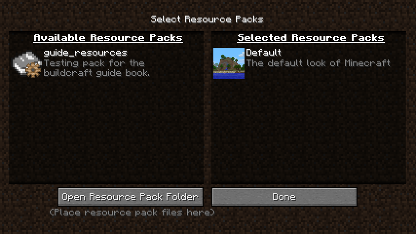

# BuildCraftGuide
The resources for the guide book, used in buildcraft for minecraft 1.12.2 and later.

## Testing

There are two ways to test forks of this repository: either the simple way or the better (but more complex) way.

Both of the options need [git](https://git-scm.com/) installed, or one of the [GUI based git alternatives](https://git-scm.com/downloads/guis).

### The simple way

1. Create a new nearly-empty profile in your minecraft launcher, which points to a separate folder for running the game in.
    - (This should use minecraft 1.12.2)
1. Install the recommended versions of forge and buildcraft for 1.12.2.
    - (Generally it's simpler if the only installed mod is buildcraft and related mods).
1. Clone this repository using the command `git clone https://github.com/BuildCraft/BuildCraftGuide.git` into a completely different folder
    - This should create a folder called "BuildCraftGuide", which contains a few files and a "guide_resources" folder
1. Copy the "guide_resources" folder into the "resourcepacks" folder in the newly-created profile.
1. Enable that resource pack in the resource pack selection screen, which should look something like this:

### The better way

This is identical to the simple way, but uses a symbolic link ([wikipedia](https://en.wikipedia.org/wiki/Symbolic_link#Overview)) rather than copying the folder across. (This saves time when testing out changes to the git repository, as modifications to the git-tracked directory will also update the symbolic linked directory).

Note that a symbolic link is *not* the same as a windows shortcut, as they work in different ways.

1. Create a new nearly-empty profile in your minecraft launcher, which points to a separate folder for running the game in.
    - (This should use minecraft 1.12.2)
1. Install the recommended versions of forge and buildcraft for 1.12.2.
    - (Generally it's simpler if the only installed mod is buildcraft and related mods).
1. Clone this repository using the command `git clone https://github.com/BuildCraft/BuildCraftGuide.git` into a completely different folder
    - This should create a folder called "BuildCraftGuide", which contains a few files and a "guide_resources" folder
1. Create a symbolink link in the "resourcepacks" folder in the newly-created profile, which points to the "guide_resources" folder
    - In Mac OSX or Linux you'll need to run the following commands in a terminal:
    `cd /the_profile_directory/resourcepacks/`
    `ln -s /the_cloned_directory/BuildCraftGuide/guide_resources`
    - In Windows the process is a bit more of a pain, but (apparently) still possible in an (administrator) command prompt:
    `cd C:\the_profile_directory\resourcepacks\`
    `mklink /D Link `
1. Enable that resource pack in the resource pack selection screen, which should look the same as the simple way's screenshot.

## Contributing

Unlike testing there are a few additional steps you need to take to contribute to this repository. You'll need a github account, and a fork of this repository. You'll also need reasonable knowledge of working with git itself (to update your forked version to the latest version on github, pushing your own changes, switching branches, etc).

While it's possible to contribute directly through github's website please limit this to only minor changes - as you won't be able to test your changes.

Unlike when testing you'll need to clone your forked repository and add the original repository as an additional remote (or clone the original repository and add your fork as an additional remote).

### Adding content

The simplest content to add is just to improve an existing markdown page - so any file that ends with ".md".

Most of the time you can just write text normally (or prefix a chapter with # hashes), however for anything special (like links, colours, recipes, etc) you'll need to refer to the [Guide Page File Format](guide_resources/assets/buildcraftlib/compat/buildcraft/guide/en_us/config/guide_page_format.md) page.

### New pages

Adding additional pages also requires a few more things:

 - Creating a new markdown file to contain the relevant text.
 - Adding an entry to the [Json instruction file format](guide_resources/assets/buildcraftlib/compat/buildcraft/guide/en_us/config/json_insn_format.md) (guide.txt files) to link to that markdown page.
 - Possibly adding a language entry to [guide_resources/assets/buildcraftlib/lang/en_US.lang](guide_resources/assets/buildcraftlib/lang/en_US.lang).

### Translations

Currently no translations are accepted - at least not until a page has a fully-correct english page that it can be translated from.
